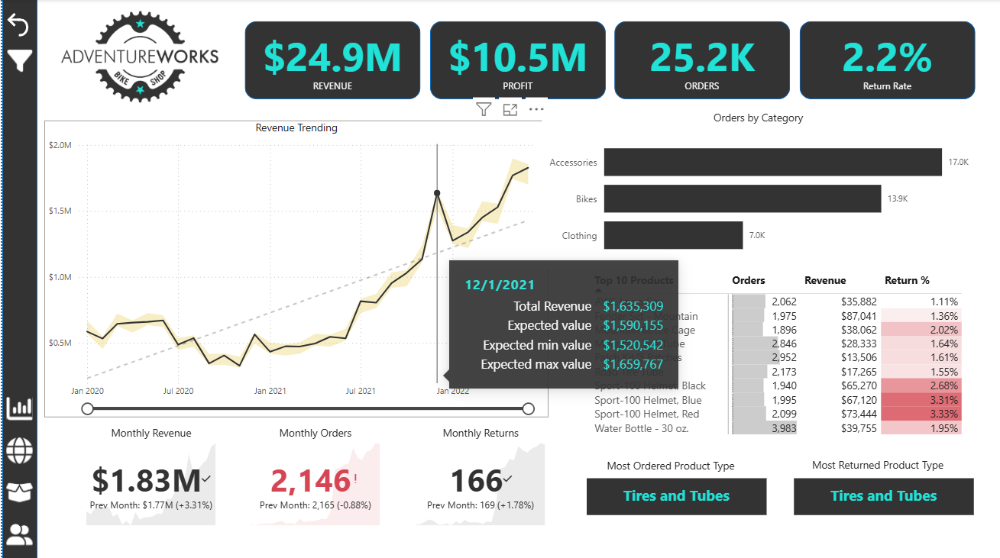
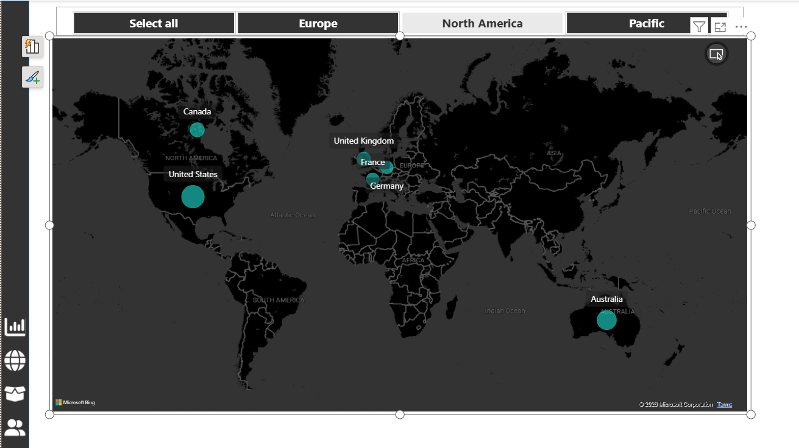
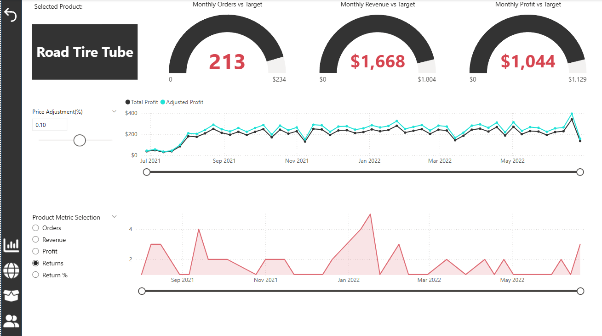
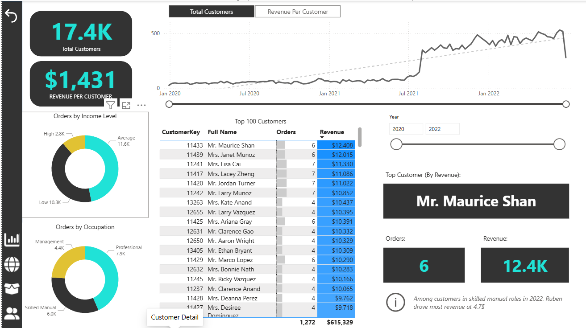

# AdventureWorks Sales Analytics Dashboard


An interactive Power BI report built for executive sales performance analysis, customer segmentation, product performance review, and regional sales exploration using the AdventureWorks business dataset.

This project is packaged as a portfolio case study: the PBIX report is included, and the documentation explains the business problem, dashboard design, data model, report pages, and analytical choices behind the build.

## Business Objective

AdventureWorks needs a single analytics experience for leaders to monitor sales performance, understand revenue and profit movement, identify product and customer patterns, and drill into operational details without switching reports.

The dashboard answers:

- How are revenue, profit, orders, returns, and customer counts performing against business targets?
- Which product categories, subcategories, and individual products are driving performance?
- Where are sales concentrated geographically?
- Which customer segments contribute the most value?
- How do monthly trends and target gaps change over time?

## Report File

Open the Power BI file here:

```text
reports/AdventureWorks_Report.pbix
```

Power BI Desktop is required to view, edit, or publish the report.

## Dashboard Page Showcase

### Executive Dashboard



The executive dashboard is the main leadership view. It summarizes revenue, profit, order volume, and return rate, then combines revenue trending, product category performance, top products, and monthly KPI cards so users can quickly understand overall sales health.

Key questions answered:

- Are revenue, profit, orders, and return rate performing well?
- Which categories and products are driving order volume?
- How are monthly revenue, orders, and returns changing over time?

### Geographic Sales View



The map page shows sales performance by geography. It gives business users a simple way to compare regional concentration across North America, Europe, and Pacific markets, with country-level bubbles for quick visual comparison.

Key questions answered:

- Which regions and countries generate the strongest sales activity?
- Where is AdventureWorks most geographically concentrated?
- How does performance vary across major territories?

### Product Detail



The product detail page supports drillthrough analysis for an individual product. It compares selected product orders, revenue, and profit against targets, includes a price-adjustment control, and tracks profit and return behavior over time.

Key questions answered:

- Is the selected product meeting order, revenue, and profit targets?
- How would price adjustments affect profitability?
- What does the return trend look like for this product?

### Customer Detail



The customer detail page focuses on customer segmentation and customer-level value. It shows customer count, revenue per customer, income and occupation breakdowns, top customers by revenue, and selected customer KPIs.

Key questions answered:

- Which customers generate the most revenue?
- How do income level and occupation segments contribute to orders?
- What are the order and revenue metrics for the top customer?

## Portfolio Highlights

- Executive KPI dashboard with revenue, profit, order, return, and customer performance.
- Drillthrough product detail page for focused product-level analysis.
- Customer detail page with segmentation and customer-level metrics.
- Geographic map page for territory and country-level exploration.
- Dynamic metric selector tables for product and customer analysis.
- Target-gap measures for revenue, profit, and order performance.
- Navigation buttons, bookmarks, custom icons, report tooltip page, and branded AdventureWorks styling.

## Report Pages

| Page | Purpose |
|---|---|
| EXEC Dashboard | Executive landing page for sales KPIs, trend monitoring, targets, slicers, and summary visuals. |
| Map | Geographic view for exploring sales performance by territory, country, and continent. |
| Product Detail | Drillthrough page for product-level trends, return behavior, and profitability context. |
| Customer Detail | Customer analytics page for segmentation, customer value, and selected customer performance. |
| Category Tooltip | Custom tooltip page used to add context to category-level interactions. |

## Data Model

The report uses a clean dimensional model with lookup tables for calendar, customers, products, categories, subcategories, and territories. It also includes disconnected metric-selection and price-adjustment tables for interactive analysis.

Key tables identified in the report:

- `Calendar Lookup`
- `Customer Lookup`
- `Product Lookup`
- `Product Categories Lookup`
- `Product Subcategories Lookup`
- `Territory Lookup`
- `Measure Table`
- `Customer Metric Selection`
- `Product Metric Selection`
- `Price Adjustment(%)`

## Key Measures And Fields

The report includes business measures such as:

- `Total Revenue`
- `Total Profit`
- `Total Orders`
- `Total Returns`
- `Return Rate`
- `Total Customers`
- `Average Revenue Per Customer`
- `Revenue Target Gap`
- `Profit Target Gap`
- `Order Target Gap`
- `Previous Month Revenue`
- `Previous Month Orders`
- `Previous Month Returns`
- `Adjusted Profit`

## Skills Demonstrated

- Power BI dashboard design and UX flow
- Star-schema data modeling
- DAX measure development
- KPI and target-gap reporting
- Drillthrough and tooltip design
- Bookmark and button navigation
- Slicer-driven exploratory analysis
- Executive storytelling with operational detail paths

## Repository Structure

```text
adventureworks-powerbi-portfolio/
├── README.md
├── reports/
│   └── AdventureWorks_Report.pbix
├── assets/
│   └── adventureworks-logo.png
├── screenshots/
│   ├── exec-dashboard.png
│   ├── map-view.png
│   ├── product-detail.png
│   └── customer-detail.png
└── docs/
    ├── dashboard-storyboard.md
    ├── portfolio-website-copy.md
    └── technical-summary.md
```

## How To Use

1. Clone or download this repository.
2. Open `reports/AdventureWorks_Report.pbix` in Power BI Desktop.
3. Review the EXEC Dashboard first for the executive summary.
4. Use navigation buttons, slicers, drillthrough, and tooltip interactions to explore product, customer, and territory performance.
